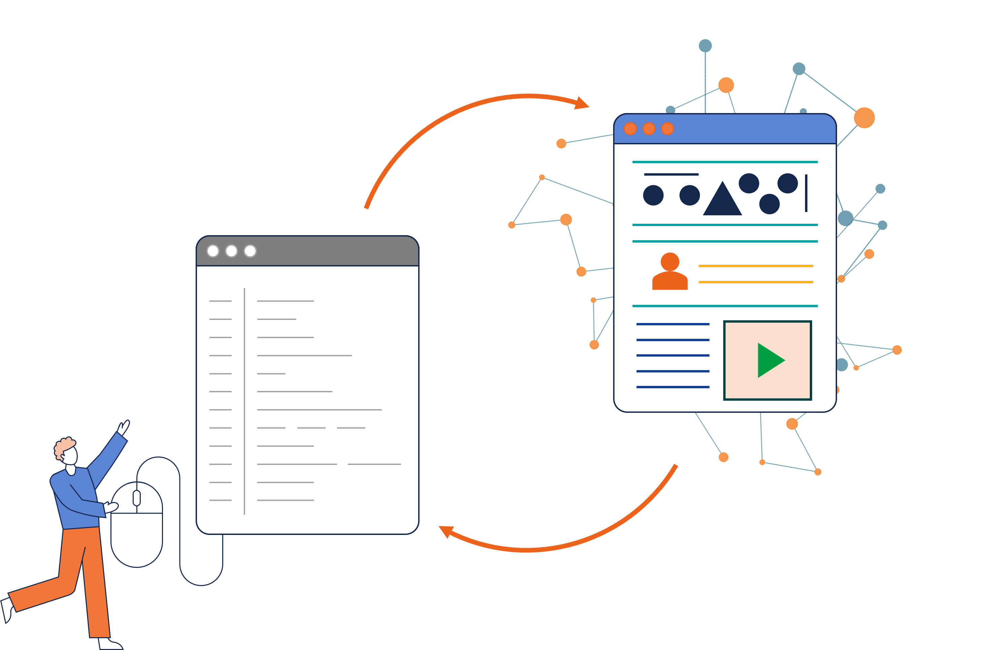

## 2.1 What is Markdown?

### Introduction to Lightweight Markup Language

Markdown is a lightweight markup language that allows you to write content in a simple and easy-to-read plain-text format, which can be converted to various formats like HTML or PDF (Figure 1). Its simplicity and readability make it ideal for documentation, technical writing, and lesson creation.
{: style="transform: scale(0.5);"}

### Why Markdown is Essential for ELIXIR Lessons

Markdown's versatility and ease of use are key for creating accessible and collaborative lesson content in ELIXIR. It enables researchers and educators to focus on content while ensuring compatibility with a variety of tools and platforms. By using Markdown, lessons can be version-controlled and easily shared within the community.

## 2.2 Markdown Syntax


### Writing Headers
Use `#` symbols to define headers:

```markdown
# Header 1
## Header 2
### Header 3
```

### Lists
#### Ordered Lists:
```markdown
1. First item
2. Second item
3. Third item
```

#### Unordered Lists:
```markdown
- Item 1
- Item 2
  - Sub-item
```

### Text Formatting
#### Bold and Italic Text:
- **Bold**: `**text**`
- *Italic*: `*text*`
- ***Bold and Italic***: `***text***`

#### Inline Code and Code Blocks:
- Inline Code: `` `code` ``
- Code Blocks:

    ```markdown
    ```
    Code block content
    ```
    ```

### Links and Images
#### Embedding external links:

When linking to an external site, use:

```md
[Google](http://google.com)
```

#### Linking to internal pages:

When linking to internal pages, you can manually link to the pages like this:

```md
[Planning](planning)
```
Will link to the planning page.

If you change the file name, you'll have to update all of your links.


#### Adding Images:
```markdown

```
Supported attributes include:

* `click`: if true, the image will be clickable -> the image will be loaded in another tab
* `url`: f you want the image to link to anther page
* `alt`: describes the image and is used for people that are visually impaired
* `caption`: Text that will appear under the image
* `inline`: if true this image can be used in a list
* `max-width`: Max width in px or em

Make sure to credit images under CC-BY or other appropriate licenses.

### Tables
#### Creating Tables:
```markdown
| Header 1 | Header 2 | Header 3 |
|----------|----------|----------|
| Data 1   | Data 2   | Data 3   |
```

### Checklists
#### Interactive Checklists:
```markdown
- [ ] Task 1
- [x] Completed Task
```

---

## 2.3 Tools for Markdown Editing


### Markdown Editors
There are various tools available for writing and editing Markdown:

- **Visual Studio Code**: A powerful code editor with Markdown plugins.
- **Typora**: A clean and distraction-free Markdown editor.
- **Dillinger**: An online Markdown editor for quick editing and previews.

### Hands-on Practice
Explore these tools to gain proficiency in Markdown. Use their preview and export features to create well-formatted documents for ELIXIR lessons.

