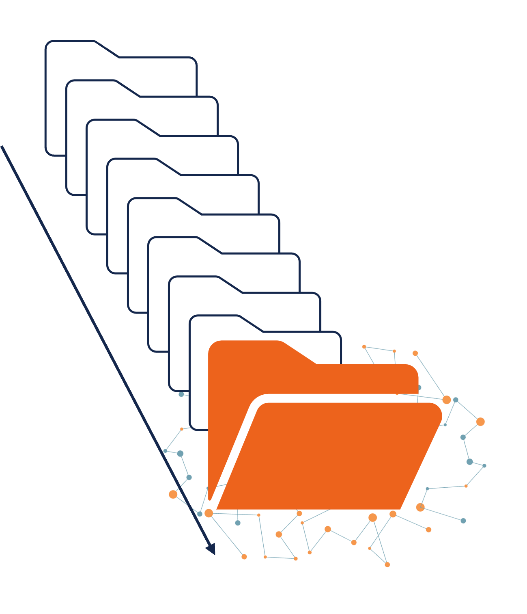
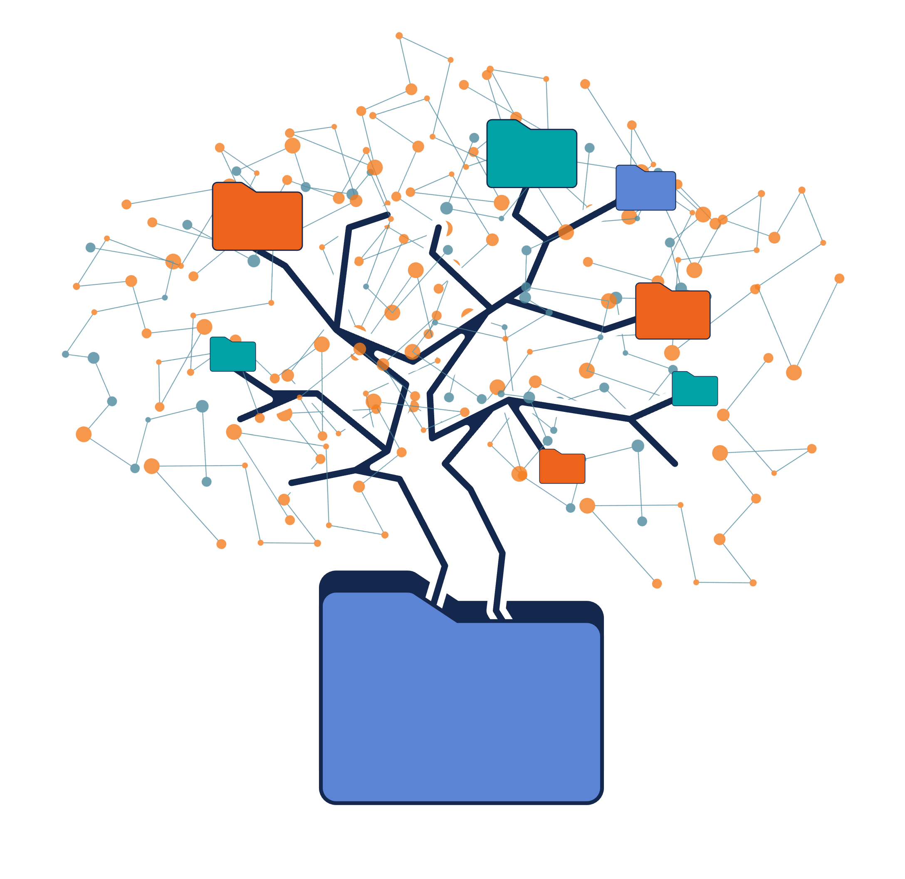
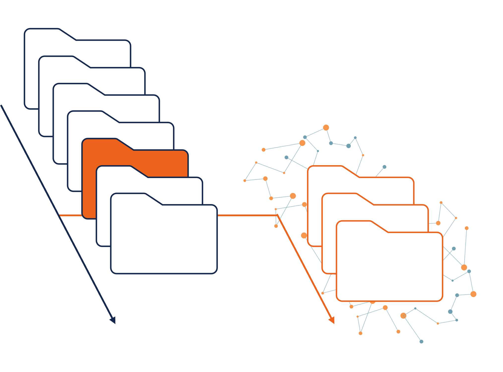

## 3.1 Introduction to GitHub

### Overview of Version Control
Version control is a system that records changes to files over time, allowing collaboration, tracking modifications, and reverting to previous versions if necessary. It is crucial for lesson development as it ensures transparency, collaboration, and a structured workflow for content creation.

GitHub, a widely used platform for version control, provides tools for managing projects, tracking changes, and collaborating effectively with others in an open and distributed manner.

{: style="width:50%;"}

---

## 3.2 Key GitHub Concepts

### Repositories
A repository (or repo) is a centralized location where all files related to a project are stored and managed. It maintains a complete version history of the project, allowing users to track changes, compare different versions, and revert to previous states when necessary. Repositories also facilitate collaboration by enabling multiple contributors to work on the same project, review changes, and merge updates seamlessly.

{: style="width:200px;"}

#### Creating a Repository:
1. Sign in to GitHub.
2. Click on the "+" in the upper-right corner and select "New repository."
3. Name your repository and choose visibility settings.
4. Click "Create repository."

#### Cloning a Repository:
1. Navigate to the repository on GitHub.
2. Click on the "Code" button.
3. Choose "Open with GitHub Desktop."
4. Follow the prompts to clone the repository locally.

### Branches
Branches allow developers to work on new features or fixes in isolation without affecting the main project. This makes it easier to experiment with new ideas, review and test changes, and merge updates only when they are fully ready. Branches help teams collaborate by preventing conflicts and keeping the main project stable while development progresses.

{: style="width:200px;"}

#### Creating and Switching Branches:
1. Navigate to the repository on GitHub.
2. Click on the "main" branch dropdown.
3. Type a new branch name and click "Create branch."

### Commits
Commits act as checkpoints that record changes made to a repository, ensuring a clear and structured history of modifications. Each commit includes a unique identifier and a descriptive message, helping contributors understand what changes were made and why. This makes it easier to track progress, troubleshoot issues, and collaborate effectively.

{: style="width:200px;"}

#### Making a Commit:
1. Navigate to the repository on GitHub.
2. Open a file and make edits.
3. Scroll down and enter a commit message.
4. Click "Commit changes."

### Pull Requests
Pull requests (PRs) serve as a structured way to propose changes, facilitate discussions, and ensure quality control before merging updates into the main branch. They provide a collaborative environment where reviewers can leave comments, suggest improvements, and approve changes, ensuring that updates meet project standards and requirements.

{: style="width:200px;"}

#### Creating a Pull Request:
1. Navigate to the repository on GitHub.
2. Click on the "Pull Requests" tab.
3. Click "New Pull Request."
4. Select the branch to merge and add a description.
5. Click "Create Pull Request."

### Issues and Project Boards
Issues serve as a centralized way to document and track tasks, report bugs, and propose new features. They enable teams to discuss problems, assign responsibilities, and monitor progress. Project boards, on the other hand, offer a Kanban-style workflow for visually organizing tasks, setting priorities, and streamlining project management.

#### Creating an Issue:
1. Navigate to the repository’s "Issues" tab.
2. Click "New Issue."
3. Enter a title and description.
4. Click "Submit new issue."

---

## 3.3 Practical Tools

### Hands-on Practice
GitHub provides multiple user-friendly tools to simplify version control and collaboration:

- **GitHub Desktop**: A GUI application for managing repositories.
- **GitHub Web Interface**: Offers easy access to repository settings, commits, and collaborative features.

Practice using these tools to improve workflow and enhance collaboration in lesson development.

