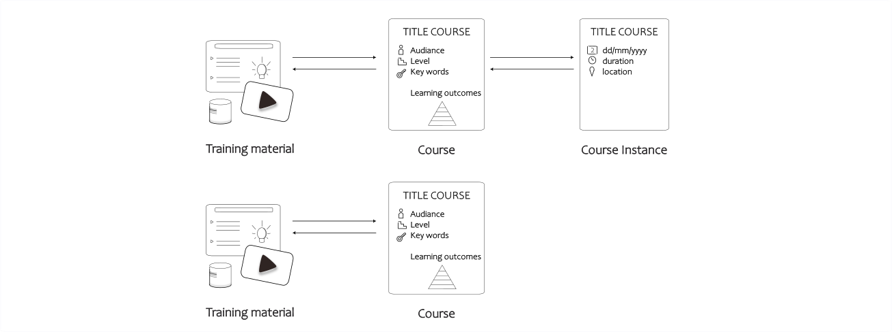
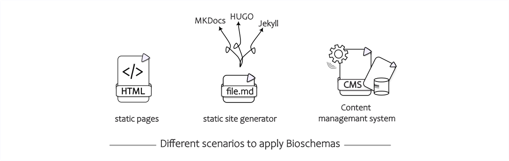
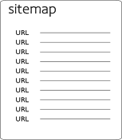

# What are the major bits and pieces OR How to mark up your content with Bioschemas?

[add-bioschemas file='docs/training-material.yaml']

{align=right}

Most webmasters are familiar with HTML tags on their pages. Usually, HTML tags tell the browser how to display the information included in the tag. For example, `<h1>Avatar</h1>` tells the browser to display the text string "Avatar" in a heading 1 (h1) format. However, the HTML tag doesn't give any information about what that text string "Avatar" means. It could refer to the hugely successful 3D movie, or it could refer to a type of profile picture. Missing a clear definition can make it more difficult for search engines to intelligently display relevant content to a user.

With the goal to help search engines understand the web content better, webmasters use [Schema.org](https://schema.org) to add **structured data** to their websites. Schema.org helps webmasters to provide a collection of shared **vocabularies** which they can use to mark up their pages in ways that can be understood by the major search engines: Google, Microsoft and alike. This can lead to improved search rankings and more attractive search results. The term vocabulary in this broad context refers to a set of **types** and **properties** used to describe different content, such as products, reviews, or events. Each content type has an extensive set of associated properties. At the end of 2024, Schema.org lists more than 800 types with close to 1500 properties. Altogether they form the allowed vocabulary, webmasters can use to mark up their websites. How can this markup be included on websites? Webmasters can choose three different formats to add information to their Web content: [JSON-LD](https://en.wikipedia.org/wiki/JSON-LD), [Microdata](https://en.wikipedia.org/wiki/Microdata_(HTML)), or [RDFa](https://en.wikipedia.org/wiki/RDFa) formats. 

As training providers, we can also use these structured data to increase findability of our training-related content in web browsers. The **[Bioschemas](https://bioschemas.org/)** community aims to improve the **findability** on the web of life sciences resources such as datasets, software, and **training materials**. It does this by encouraging people in the life sciences to use Schema.org markup in their websites so that they are indexable by search engines and other services. They define usage **profiles** over the Schema.org types that identify the essential properties to use in describing a resource. This guide will help get you up to speed with Bioschemas and the **JSON-LD** format so that you can start adding markup to your web pages. Although this guide focuses on Bioschemas and JSON-LD objects, the basic ideas (types, properties etc.) introduced here are relevant beyond JSON-LD and apply for other markup with microdata or RDFa.

# Bioschemas profiles for training resources

Many training related resources will include pages describing tutorials or courses. As such, they are marked up using the following three profiles:

- `TrainingMaterial`: A profile describing training materials in life sciences, it can be used on its own (as it happens with the Bioschemas tutorials) or in combination with a `CourseInstance`.
- `Course`: A profile describing a course from a generic point of view, i.e., the learning objectives of a course rather than where and when it is delivered.
- `CourseInstance`: A profile describing a particular instance of a course, i.e., an edition of a course that is scheduled for specific dates and happening in a specific location (that of course can be online or on-site, virtual or real).

Note that the `CourseInstance` profile is used in tandem with the `Course` profile, i.e., a `CourseInstance` does not exist without a `Course` but a `Course` can exist without a `CourseInstance` (there are no current offerings of the course).

# Use cases described in this guide

We will describe three different scenarios: the first one being a simple situation with static HTML pages in a GitHub repository containing the course description and the tutorial -- secondly, hosting training material content using static site generators like mkdocs or Jekyll and lastly, providing the training content via a Content Management System like WordPress.

# Why do we use a sitemap to indicate where our training content is on the website?

{align=left}

A sitemap is a file where you provide information about the pages, videos, and other files on your site, and the relationships between them. Search engines like Google read this file to crawl your site more efficiently. A sitemap helps search engines discover URLs on your site. The sitemap will be important so that scrapers like the Bioschemas scraper developed by the TeSS team can find your pages and their structured metadata increasing the findability of the training material.

# Further reading and Implementations

For concrete examples and further reading, please go to the more extensive ELIXIR Training Platform course material about [Bioschemas annotation](https://elixir-europe-training.github.io/ELIXIR-TrP-Bioschemas/). 
